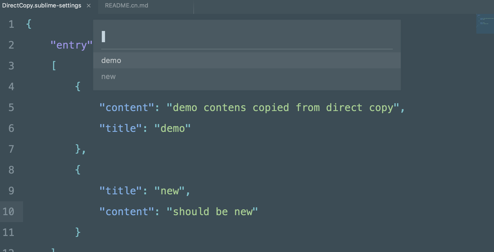

Sublime Text 的 `Direct Copy` 包能根据配置, 通过快捷键快速复制常用文本内容

## 安装

有两种方式可以安装, 第一种是通过 `Package Control`:

1. 确保装有 Package Control, 参见 <https://packagecontrol.io/installation>
2. 搜索 `Direct Copy` 并安装

另一种方式是直接通过克隆源码安装:

1. 进入 sublime text 的包目录
2. 运行 `git clone https://github.com/UniFreak/SublimeDirectCopy.git`

## 配置 & 使用

已经提供了一个默认的 `demo` 配置, 你可以在 `entry` 配置项下面, 依照 `demo` 的配置添加额外的项目名称 (`title` 配置项) 及其内容 (`context` 配置项). 如下:

```json
{
    "entry":
    [
        {
            "title" : "demo",
            "content" : "demo contens copied from direct copy"
        },
    ]
}
```

配置完成后, 可以通过快捷键 `ctrl+shift+c` (Windows) 或 `super+shift+c` (Mac) 调出拷贝列表, 选中即可拷贝对应文本, 如图

